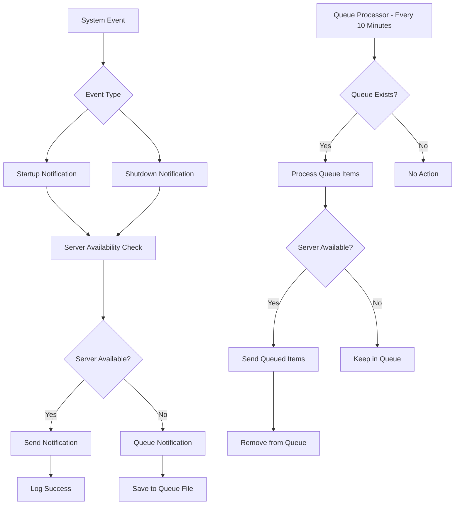

# ntfy Windows Notifications Project

[](https://github.com/PowerShell/PowerShell)
[](https://www.microsoft.com/windows)
[](https://opensource.org/licenses/Apache-2.0)
[](https://ntfy.sh)

**Professional Windows Boot/Shutdown Notification System with Offline Queue Management**

*Created by [Dimitris Kyrtopoulos](https://kyrtopoulos.com) | [LinkedIn](https://www.linkedin.com/in/kyrtopoulos)*

---

## Table of Contents

1. [Project Overview](#project-overview)
2. [Architecture & Design](#architecture--design)
3. [Installation & Setup](#installation--setup)
4. [Configuration Management](#configuration-management)
5. [File Structure](#file-structure)
6. [Deployment Methods](#deployment-methods)
7. [System Features](#system-features)
8. [Testing & Diagnostics](#testing--diagnostics)
9. [Troubleshooting Guide](#troubleshooting-guide)
10. [Advanced Configuration](#advanced-configuration)
11. [Best Practices](#best-practices)
12. [Technical Reference](#technical-reference)

---

## Project Overview

The **ntfy Windows Notifications Project** is an enterprise-grade notification system designed to monitor Windows system events (startup, shutdown, restart) and deliver real-time notifications through ntfy servers. The system features offline queue support, dual-server failover, comprehensive logging with rotation, and multiple deployment options suitable for both standalone computers and domain environments.

### Key Features

- **Comprehensive Event Monitoring**: Tracks all Windows startup and shutdown events with Fast Startup detection
- **Dual-Server Failover**: Automatic failover between local and remote ntfy servers
- **Offline Queue System**: Stores notifications when servers are unavailable and delivers them when connectivity is restored
- **Advanced Logging**: Separate log files for different components with automatic rotation
- **Multiple Deployment Options**: Group Policy (recommended) and Task Scheduler deployment methods
- **Enterprise Security**: Secure file permissions and SYSTEM-level execution
- **Startup Type Detection**: Distinguishes between Fast Startup (hibernation) and true cold startup
- **Centralized Configuration**: Single INI file for all system settings

### System Requirements

- **Operating System**: Windows 10, Windows 11, Windows Server 2016+
- **PowerShell**: Version 5.1 or higher
- **Privileges**: Administrator rights required for installation
- **Network**: Internet connectivity for remote notifications (local server optional)

### Tested Environments

This project has been fully tested and validated on:
- **Windows 10 Enterprise 22H2** (Clean deployment)
- **Windows 11 Pro 24H2** (Clean deployment)

---

## Architecture & Design

### System Components

```
ntfy-notifications/
├── Core Engine
│   └── ntfy-core-functions.ps1          # Main processing engine
├── Wrappers
│   ├── ntfy-startup-wrapper.cmd         # Startup event handler
│   ├── ntfy-shutdown-wrapper.cmd        # Shutdown event handler
│   └── ntfy-queue-processor.cmd         # Queue processing handler
├── Setup & Configuration
│   ├── ntfy-setup.ps1                   # Interactive setup script
│   └── ntfy-notifications-config.ini    # Centralized configuration
└── Testing & Diagnostics
    ├── test-ntfy-system.ps1             # System functionality tests
    └── test-startup-types.ps1           # Startup type analysis
```

### Data Flow Architecture



### Security Architecture

- **Execution Context**: SYSTEM account for reliable startup/shutdown access
- **File Permissions**: Restricted to SYSTEM and Administrators groups
- **Configuration Security**: Sensitive credentials stored in protected directory
- **Network Security**: Support for authenticated ntfy servers with Basic Authentication

---

### Installation & Setup

### Interactive Installation

The system provides an interactive setup script that guides you through configuration and automatically downloads, configures, and deploys all components.

#### Step-by-Step Installation Process

1. **Download the setup script**:
   ```powershell
   Invoke-WebRequest -Uri "https://raw.githubusercontent.com/kyrtopoulos/Windows/main/Scripts/ntfy-notifications/ntfy-setup.ps1" -OutFile "ntfy-setup.ps1"
   ```

2. **Run the interactive setup**:
   ```powershell
   .\ntfy-setup.ps1
   ```

3. **Follow the interactive prompts**:
   - **Server Configuration**: Enter your local and remote ntfy server URLs
   - **Topic Configuration**: Set your notification topic name
   - **Authentication**: Optionally configure username/password for secured servers
   - **Deployment Method**: Choose between Group Policy or Task Scheduler deployment

4. **Automatic File Download**: The script automatically downloads all required files from GitHub

5. **Task Creation**: Appropriate scheduled tasks are created based on your deployment choice

6. **Configuration Summary**: Review the installation summary and next steps

#### Advanced Installation Options

```powershell
# Silent installation with default settings
.\ntfy-setup.ps1 -Silent

### Interactive Setup Process

The setup script guides you through:

1. **Cleanup Detection**: Automatically detects and removes previous installations
2. **Server Configuration**: Configure local and remote ntfy server endpoints
3. **Authentication Setup**: Optional username/password for secured servers
4. **Deployment Method Selection**: Choose between Group Policy or Task Scheduler
5. **File Download**: Automatically downloads all required files from GitHub
6. **Task Creation**: Creates appropriate scheduled tasks based on deployment method
7. **Validation**: Provides testing instructions and configuration summary

### Setup Parameters

```powershell
# Silent installation with defaults
.\ntfy-setup.ps1 -Silent

# Custom installation path
.\ntfy-setup.ps1 -InstallPath "D:\ntfy-notifications"
```

---

## Configuration Management

### Primary Configuration File

**File**: `ntfy-notifications-config.ini`

```ini
[Server]
LocalServer=http://192.168.1.100:8080
RemoteServer=https://ntfy.sh
Topic=MyWindowsNotifications
Username=your_ntfy_username
Password=your_ntfy_password

[Timeouts]
NetworkTest=5
Startup=15
Shutdown=8
QueueProcessor=15

[Settings]
LoggingEnabled=true
MaxRetries=3
RetryIntervalMinutes=5

[Logging]
# Separate log files for different components
StartupLogFile=ntfy-startup-notifications.log
ShutdownLogFile=ntfy-shutdown-notifications.log
QueueLogFile=ntfy-queue-processor.log
WrapperLogFile=ntfy-wrapper.log
# Log rotation settings
MaxLogSizeMB=10
MaxLogFiles=5
EnableLogRotation=true

[Paths]
# These will be relative to the script directory
QueueFile=ntfy-notification-queue.json
```

### Configuration Parameters

| Section | Parameter | Description | Default | Impact |
|---------|-----------|-------------|---------|---------|
| **Server** | LocalServer | Primary ntfy server URL | `http://localhost:8080` | First server attempted for notifications |
| **Server** | RemoteServer | Fallback ntfy server URL | `https://ntfy.sh` | Used when local server unavailable |
| **Server** | Topic | Notification topic name | `MyWindowsNotifications` | ntfy topic for message delivery |
| **Server** | Username | Authentication username | *(empty)* | Optional Basic Auth username |
| **Server** | Password | Authentication password | *(empty)* | Optional Basic Auth password |
| **Timeouts** | NetworkTest | Server connectivity timeout | `5` | Seconds to wait for server response |
| **Timeouts** | Startup | Startup notification timeout | `15` | Seconds to wait for startup notifications |
| **Timeouts** | Shutdown | Shutdown notification timeout | `8` | Seconds to wait for shutdown notifications |
| **Timeouts** | QueueProcessor | Queue processing timeout | `15` | Seconds to wait for queued notifications |
| **Settings** | LoggingEnabled | Enable/disable logging | `true` | Controls all log file generation |
| **Settings** | MaxRetries | Retry attempts for failed notifications | `3` | Number of retry attempts (future feature) |
| **Settings** | RetryIntervalMinutes | Minutes between retry attempts | `5` | Delay between retries (future feature) |
| **Logging** | MaxLogSizeMB | Log file size limit | `10` | MB before log rotation occurs |
| **Logging** | MaxLogFiles | Number of backup log files | `5` | Backup files to maintain during rotation |
| **Logging** | EnableLogRotation | Enable automatic log rotation | `true` | Prevents unlimited log file growth |

### Configuration Updates

All configuration changes take effect immediately on the next script execution. No service restart required.

**Note**: The Queue Processor interval (default: 10 minutes) is configured during initial Task Scheduler setup. To modify the interval for existing installations, manually update the scheduled task:

```powershell
# View current task configuration
Get-ScheduledTask -TaskName "ntfy Queue Processor" | Get-ScheduledTaskInfo

# To change interval, delete and recreate the task
Unregister-ScheduledTask -TaskName "ntfy Queue Processor" -Confirm:$false
# Run setup script again to recreate with new interval
```

---

## File Structure

### Installation Directory Layout

```
C:\ntfy-notifications\
├── Configuration
│   └── ntfy-notifications-config.ini           # Master configuration file
├── Core System
│   └── ntfy-core-functions.ps1                 # Main processing engine
├── Event Handlers
│   ├── ntfy-startup-wrapper.cmd                # Startup notification wrapper
│   ├── ntfy-shutdown-wrapper.cmd               # Shutdown notification wrapper
│   └── ntfy-queue-processor.cmd                # Queue processing wrapper
├── Setup & Management
│   └── ntfy-setup.ps1                          # Interactive setup script
├── Testing & Diagnostics
│   ├── test-ntfy-system.ps1                    # System functionality tests
│   └── test-startup-types.ps1                  # Startup type analysis tools
├── Documentation
│   └── ntfy-Windows-Notifications-Project.md   # Complete documentation (Markdown)
├── Runtime Data
│   └── ntfy-notification-queue.json            # Offline notification queue
└── Logs
    ├── ntfy-startup-notifications.log          # Startup event logs
    ├── ntfy-shutdown-notifications.log         # Shutdown event logs
    ├── ntfy-queue-processor.log                # Queue processing logs
    └── ntfy-wrapper.log                        # Batch wrapper execution logs
```

### File Descriptions

| File | Purpose | Execution Context |
|------|---------|-------------------|
| `ntfy-core-functions.ps1` | Main PowerShell engine handling all notification logic | SYSTEM |
| `ntfy-startup-wrapper.cmd` | Batch wrapper for startup notifications | SYSTEM |
| `ntfy-shutdown-wrapper.cmd` | Batch wrapper for shutdown notifications | SYSTEM |
| `ntfy-queue-processor.cmd` | Batch wrapper for queue processing | SYSTEM |
| `ntfy-setup.ps1` | Interactive installation and configuration script | Administrator |
| `test-ntfy-system.ps1` | Comprehensive system testing utilities | Administrator |
| `test-startup-types.ps1` | Startup type analysis and Fast Startup configuration | Administrator |
| `ntfy-notifications-config.ini` | Centralized configuration file | Read by SYSTEM |
| `ntfy-notification-queue.json` | Offline notification queue storage | Read/Write by SYSTEM |

---

## Deployment Methods

The system offers two deployment methods to accommodate different environments and requirements:

### Group Policy Deployment (Recommended)

Group Policy deployment provides the most reliable startup and shutdown event detection, particularly for shutdown events which can be problematic with Task Scheduler due to Windows service shutdown timing.

#### Advantages
- **Reliable shutdown detection**: Scripts execute before Windows services shut down
- **No timing issues**: Guaranteed execution during startup/shutdown phases
- **Enterprise management**: Centralized policy management across domain
- **Priority execution**: Higher priority than scheduled tasks

#### Implementation Steps

1. **Complete system setup** using the interactive installer
2. **Choose Group Policy** during deployment method selection
3. **Configure Group Policy settings**:

   ```
   Open Group Policy Editor (gpedit.msc)
   Navigate to: Computer Configuration → Windows Settings → Scripts (Startup/Shutdown)
   
   Startup Scripts:
   - Double-click "Startup"
   - Click "Add..."
   - Script Name: C:\ntfy-notifications\ntfy-startup-wrapper.cmd
   
   Shutdown Scripts:
   - Double-click "Shutdown"  
   - Click "Add..."
   - Script Name: C:\ntfy-notifications\ntfy-shutdown-wrapper.cmd
   ```

4. **Queue processing**: Automatic via scheduled task (runs every 10 minutes)

#### Domain Environment Deployment

For domain-wide deployment:

1. **Copy installation directory** to network share (e.g., `\\domain\netlogon\ntfy-notifications`)
2. **Configure Domain GPO** with network paths
3. **Test on pilot machines** before full deployment
4. **Monitor execution** through centralized logging

### Task Scheduler Deployment

Task Scheduler deployment provides full automation but may experience intermittent shutdown notification issues due to Windows service shutdown timing.

#### Advantages
- **Full automation**: No additional configuration required
- **Local management**: Self-contained on each machine
- **Detailed scheduling**: Precise control over execution timing

#### Limitations
- **Shutdown timing issues**: Scripts may execute after network services shutdown
- **Event trigger complexity**: Event-based triggers can be unreliable
- **Service dependency**: Dependent on Task Scheduler service availability

#### Implementation

The setup script automatically creates three scheduled tasks:

| Task Name | Trigger | Description | Reliability |
|-----------|---------|-------------|-------------|
| `ntfy Startup Notification` | System Startup | Executes startup notification script | High |
| `ntfy Shutdown Notification` | Event ID 1074 (Shutdown) | Executes shutdown notification script | Medium* |
| `ntfy Queue Processor` | Every 10 minutes | Processes offline notification queue | High |

**Note**: Shutdown notifications may occasionally fail due to Windows service shutdown timing. This is a known limitation of event-triggered scheduled tasks.

### Deployment Recommendation

**Use Group Policy for production environments** where reliable shutdown notifications are critical. Task Scheduler deployment is suitable for testing or standalone systems where occasional shutdown notification misses are acceptable.

---

## System Features

### Startup Type Detection

The system automatically detects and reports different Windows startup types:

#### Fast Startup Detection
- **Hibernation file analysis**: Monitors `hiberfil.sys` modification times
- **Registry inspection**: Checks `HiberbootEnabled` registry values  
- **Event log correlation**: Analyzes shutdown/startup event timing
- **Uptime analysis**: Compares system uptime with startup characteristics

#### Startup Types Reported
- **Cold Startup**: True system startup from powered-off state
- **Fast Startup**: Resume from hibernation file (hybrid boot)
- **Resume**: Wake from sleep/hibernation

### Network Resilience

#### Dual-Server Failover
```
Primary Check: Local Server (5s timeout)
├─ Success: Use local server for notification
└─ Failure: Fallback to remote server
   ├─ Success: Use remote server for notification  
   └─ Failure: Queue notification for later delivery
```

#### Offline Queue Management
- **Automatic queuing**: Failed notifications stored with original timestamp
- **Persistent storage**: JSON-based queue survives system restarts
- **Intelligent processing**: Automatic queue processing every 10 minutes
- **Enhanced delivery**: Queued notifications include delivery context

### Comprehensive Logging

#### Separate Log Files
Each system component maintains dedicated log files:

- **Startup Events**: `ntfy-startup-notifications.log`
- **Shutdown Events**: `ntfy-shutdown-notifications.log`
- **Queue Processing**: `ntfy-queue-processor.log`
- **Wrapper Execution**: `ntfy-wrapper.log`

#### Log Rotation System
- **Size-based rotation**: Configurable size limits (default 10MB)
- **Backup retention**: Configurable backup count (default 5 files)
- **Automatic management**: No manual intervention required
- **Configurable**: Can be disabled via configuration

#### Log Entry Format
```
[2025-08-31 14:23:45] [Action] Message content
```

### Advanced System Information

#### Startup Notifications Include
- Computer name and OS version
- Startup timestamp and type classification
- Fast Startup status and configuration
- Active network adapter details with IP addresses
- Server connectivity status

#### Shutdown Notifications Include
- Computer name and OS version  
- Shutdown timestamp and type classification
- System uptime (days, hours, minutes, seconds)
- Shutdown reason analysis
- Fast Startup configuration status

---

## Testing & Diagnostics

### System Testing Script

**File**: `test-ntfy-system.ps1`

Comprehensive testing utility for validating system functionality.

#### Usage Examples

```powershell
# Test all system components
.\test-ntfy-system.ps1 -TestAll

# Test individual components
.\test-ntfy-system.ps1 -TestConfiguration
.\test-ntfy-system.ps1 -TestStartup
.\test-ntfy-system.ps1 -TestShutdown  
.\test-ntfy-system.ps1 -TestQueue

# Custom installation path
.\test-ntfy-system.ps1 -TestAll -InstallPath "D:\ntfy-notifications"
```

#### Test Categories

| Test Type | Command | Purpose |
|-----------|---------|---------|
| **Configuration** | `-TestConfiguration` | Validates INI file loading and parsing |
| **Startup Notification** | `-TestStartup` | Tests startup notification generation |
| **Shutdown Notification** | `-TestShutdown` | Tests shutdown notification generation |
| **Queue Processing** | `-TestQueue` | Tests offline queue functionality |
| **All Components** | `-TestAll` | Comprehensive system validation |

#### Test Output Analysis

The test script provides:
- **File validation**: Confirms all required files are present
- **Configuration testing**: Validates INI file parsing
- **Network connectivity**: Tests ntfy server accessibility
- **Notification testing**: Validates message delivery
- **Queue functionality**: Tests offline notification handling
- **Log analysis**: Displays recent log entries from all components

### Startup Type Analysis Script

**File**: `test-startup-types.ps1`

Advanced utility for analyzing and controlling Windows startup behavior.

#### Usage Examples

```powershell
# Show current Fast Startup status and system information
.\test-startup-types.ps1 -ShowCurrentStatus

# Test startup type detection algorithm
.\test-startup-types.ps1 -TestStartupDetection

# Fast Startup management
.\test-startup-types.ps1 -DisableFastStartup
.\test-startup-types.ps1 -EnableFastStartup

# Force specific shutdown/startup scenarios
.\test-startup-types.ps1 -ForceShutdown    # True shutdown (no Fast Startup)
.\test-startup-types.ps1 -ForceRestart     # True restart cycle
```

#### Analysis Features

| Feature | Command | Purpose |
|---------|---------|---------|
| **Status Display** | `-ShowCurrentStatus` | Shows hibernation, Fast Startup, and system status |
| **Detection Testing** | `-TestStartupDetection` | Tests the startup type detection algorithm |
| **Fast Startup Control** | `-EnableFastStartup` / `-DisableFastStartup` | Controls Windows Fast Startup feature |
| **Forced Operations** | `-ForceShutdown` / `-ForceRestart` | Initiates specific shutdown scenarios |

#### Startup Analysis Output

```
Current Fast Startup Status:
============================
Hibernation Available: True
Fast Startup Registry Setting: True (Value: 1)
Hibernation File: Found (Size: 6.42 GB)
  Last Modified: 2025-08-31 14:15:23
Last Startup Time: 2025-08-31 14:16:45
System Uptime: 2:15:45
```

### Performance Monitoring

#### System Metrics
- **Notification delivery time**: From event to ntfy server
- **Queue processing efficiency**: Items processed per cycle
- **Server response times**: Local vs remote server performance  
- **Log file growth**: Monitor log rotation effectiveness

#### Health Indicators
- **Queue accumulation**: Monitor for persistent queue growth
- **Failed notifications**: Track delivery failure rates
- **Log errors**: Monitor for system integration issues
- **Server connectivity**: Track failover frequency

---

## Troubleshooting Guide

### Common Issues and Solutions

#### Issue: Shutdown Notifications Not Sent (Task Scheduler)

**Symptoms:**
- Task shows as "run" in Task Scheduler history
- No log entries in `ntfy-shutdown-notifications.log`  
- No notifications received

**Diagnosis:**
```powershell
# Check Task Scheduler logs
Get-WinEvent -FilterHashtable @{LogName='Microsoft-Windows-TaskScheduler/Operational'; ID=201,102} -MaxEvents 10

# Check for PowerShell execution errors
Get-WinEvent -FilterHashtable @{LogName='Windows PowerShell'; StartTime=(Get-Date).AddDays(-1)} | Where-Object {$_.LevelDisplayName -eq "Error"}
```

**Solution:**
Switch to Group Policy deployment for reliable shutdown notifications:

```powershell
# Remove Task Scheduler shutdown task
Unregister-ScheduledTask -TaskName "ntfy Shutdown Notification" -Confirm:$false

# Configure Group Policy shutdown script
# Use: Computer Configuration → Scripts → Shutdown → Add ntfy-shutdown-wrapper.cmd
```

**Root Cause:** Windows service shutdown timing causes network services to be unavailable when event-triggered tasks execute.

#### Issue: PowerShell Script Execution Blocked

**Symptoms:**
- Exit code 1 from wrapper scripts
- No log file generation
- "Execution Policy" errors in Event Viewer

**Diagnosis:**
```powershell
Get-ExecutionPolicy -List
```

**Solution:**
```powershell
# Enable PowerShell script execution
Set-ExecutionPolicy -ExecutionPolicy RemoteSigned -Scope LocalMachine

# Alternative: Bypass execution policy in wrappers
# Modify wrapper CMD files to include: -ExecutionPolicy Bypass
```

#### Issue: Queue Not Processing Automatically

**Symptoms:**
- Notifications queued but never delivered
- Queue file grows continuously
- No entries in `ntfy-queue-processor.log`

**Diagnosis:**
```powershell
# Check if queue processor task exists
Get-ScheduledTask -TaskName "ntfy Queue Processor" -ErrorAction SilentlyContinue

# Check task execution history
Get-ScheduledTask -TaskName "ntfy Queue Processor" | Get-ScheduledTaskInfo
```

**Solution:**
```powershell
# Recreate queue processor task
.\ntfy-setup.ps1 -Silent

# Manual queue processing
cd C:\ntfy-notifications
.\ntfy-queue-processor.cmd

# Verify queue file location
Get-Content "C:\ntfy-notifications\ntfy-notification-queue.json" | ConvertFrom-Json
```

#### Issue: Configuration Not Loading

**Symptoms:**
- Scripts fail with configuration errors
- "Configuration file not found" messages
- Default values used instead of custom settings

**Diagnosis:**
```powershell
# Verify configuration file exists and is readable
Test-Path "C:\ntfy-notifications\ntfy-notifications-config.ini"
Get-Content "C:\ntfy-notifications\ntfy-notifications-config.ini"

# Check file permissions
Get-Acl "C:\ntfy-notifications\ntfy-notifications-config.ini" | Format-Table
```

**Solution:**
```powershell
# Recreate configuration file
.\ntfy-setup.ps1

# Manual configuration validation
.\test-ntfy-system.ps1 -TestConfiguration
```

#### Issue: Network Connectivity Problems

**Symptoms:**
- All notifications queued, none delivered
- "Server not reachable" log messages
- Both local and remote servers fail

**Diagnosis:**
```powershell
# Test server connectivity manually
Test-NetConnection ntfy.sh -Port 443
Test-NetConnection 192.168.1.100 -Port 8080

# Test with PowerShell web request
Invoke-WebRequest -Uri "https://ntfy.sh" -UseBasicParsing
Invoke-WebRequest -Uri "http://192.168.1.100:8080" -UseBasicParsing
```

**Solution:**
```powershell
# Update server URLs in configuration
# Edit: C:\ntfy-notifications\ntfy-notifications-config.ini

# Test updated configuration
.\test-ntfy-system.ps1 -TestAll

# Process any queued notifications
.\ntfy-queue-processor.cmd
```

### Advanced Diagnostics

#### Script Execution Context Analysis

When troubleshooting execution issues, verify the context:

```powershell
# Check execution environment
whoami                    # Should show: nt authority\system (for scheduled tasks/GPO)
$env:COMPUTERNAME        # Computer name
Get-Location             # Current directory
$ExecutionContext.SessionState.LanguageMode  # PowerShell language mode
```

#### Log Analysis Commands

```powershell
# Monitor real-time log changes
Get-Content "C:\ntfy-notifications\ntfy-startup-notifications.log" -Wait

# Analyze log patterns
Get-Content "C:\ntfy-notifications\ntfy-startup-notifications.log" | Select-String "Error|Failed|Exception"

# Check log rotation status
Get-ChildItem "C:\ntfy-notifications\" -Filter "*.log*" | Sort-Object Name

# Monitor queue file changes
Get-Content "C:\ntfy-notifications\ntfy-notification-queue.json" -Raw | ConvertFrom-Json | Format-Table
```

#### Event Log Correlation

```powershell
# Find startup events
Get-WinEvent -FilterHashtable @{LogName='System'; ID=6005,6006,6009} -MaxEvents 10

# Find shutdown events  
Get-WinEvent -FilterHashtable @{LogName='System'; ID=1074} -MaxEvents 10

# Correlate with script execution
Get-WinEvent -FilterHashtable @{LogName='Microsoft-Windows-TaskScheduler/Operational'; StartTime=(Get-Date).AddHours(-1)}
```

---

## Advanced Configuration

### Performance Optimization

#### Network Timeout Tuning

Adjust timeout values based on network conditions:

```ini
[Timeouts]
# Fast local network
NetworkTest=3
Startup=10
Shutdown=5

# Slow/unreliable network
NetworkTest=10
Startup=30
Shutdown=15
```

#### Queue Processing Optimization

For high-volume environments, modify the Task Scheduler task for faster processing:

```powershell
# Manually modify queue processor task interval
# Note: This requires recreating the scheduled task
Unregister-ScheduledTask -TaskName "ntfy Queue Processor" -Confirm:$false
# Then recreate with modified interval via Task Scheduler GUI or PowerShell
```

### Enterprise Security Enhancements

#### Directory Security

```powershell
# Enhanced directory permissions
$acl = Get-Acl "C:\ntfy-notifications"
$acl.SetAccessRuleProtection($true, $false)

# Remove inherited permissions
$acl.Access | ForEach-Object { $acl.RemoveAccessRule($_) }

# Add specific permissions
$systemRule = New-Object System.Security.AccessControl.FileSystemAccessRule("SYSTEM","FullControl","ContainerInherit,ObjectInherit","None","Allow")
$adminRule = New-Object System.Security.AccessControl.FileSystemAccessRule("Administrators","ReadAndExecute","ContainerInherit,ObjectInherit","None","Allow")

$acl.SetAccessRule($systemRule)
$acl.SetAccessRule($adminRule)
Set-Acl -Path "C:\ntfy-notifications" -AclObject $acl
```

#### Audit Configuration

```powershell
# Enable file access auditing
auditpol /set /subcategory:"File System" /success:enable /failure:enable

# Monitor configuration file changes
$watcher = New-Object System.IO.FileSystemWatcher
$watcher.Path = "C:\ntfy-notifications"
$watcher.Filter = "*.ini"
$watcher.IncludeSubdirectories = $false
$watcher.EnableRaisingEvents = $true

$action = {
    $path = $Event.SourceEventArgs.FullPath
    $name = $Event.SourceEventArgs.Name
    $changeType = $Event.SourceEventArgs.ChangeType
    Write-Host "Configuration file $name was $changeType at $(Get-Date)"
}

Register-ObjectEvent -InputObject $watcher -EventName "Changed" -Action $action
```

---

## Best Practices

### Deployment Guidelines

#### Production Environment Checklist

- [ ] **Use Group Policy deployment** for reliable shutdown notifications
- [ ] **Test on pilot systems** before domain-wide deployment
- [ ] **Configure centralized logging** location if required
- [ ] **Implement monitoring** for queue accumulation
- [ ] **Document server credentials** in secure password manager
- [ ] **Schedule regular testing** of notification delivery
- [ ] **Monitor disk space** for log file growth

#### Security Best Practices

- [ ] **Restrict installation directory access** to SYSTEM and Administrators
- [ ] **Use HTTPS for remote servers** when possible
- [ ] **Regularly review server logs** for authentication attempts
- [ ] **Implement network segmentation** for ntfy servers
- [ ] **Monitor configuration file changes**
- [ ] **Use strong passwords** for authenticated ntfy servers

#### Maintenance Procedures

- [ ] **Regularly test notification delivery** using test scripts
- [ ] **Monitor log file sizes** and rotation effectiveness  
- [ ] **Review queue accumulation trends**
- [ ] **Verify scheduled task execution**
- [ ] **Update server URLs** as infrastructure changes
- [ ] **Document any configuration modifications**

### Performance Guidelines

#### Resource Management

- **Log Rotation**: Enable automatic rotation to prevent disk space issues
- **Queue Management**: Monitor for persistent queue growth indicating connectivity issues
- **Script Timeouts**: Adjust timeout values based on network performance
- **Execution Frequency**: Queue processor runs every 10 minutes by default (configurable)

#### Monitoring Recommendations

```powershell
# Monitor key metrics
$queueSize = (Get-Content "C:\ntfy-notifications\ntfy-notification-queue.json" -Raw | ConvertFrom-Json).Count
$logSize = (Get-Item "C:\ntfy-notifications\ntfy-startup-notifications.log").Length / 1MB
$lastExecution = (Get-ScheduledTask -TaskName "ntfy Queue Processor" | Get-ScheduledTaskInfo).LastRunTime

Write-Host "Queue Size: $queueSize items"
Write-Host "Log Size: $([math]::Round($logSize, 2)) MB"
Write-Host "Last Queue Processing: $lastExecution"
```

---

## Technical Reference

### PowerShell Functions Reference

#### Core Functions (`ntfy-core-functions.ps1`)

| Function | Purpose | Parameters |
|----------|---------|------------|
| `Initialize-Configuration` | Loads and parses INI configuration | None |
| `Test-NtfyServer` | Tests server connectivity | `ServerUrl`, `TimeoutSeconds` |
| `Send-NtfyNotification` | Sends notification to server | `ServerUrl`, `Title`, `Message`, `Priority`, `Tags`, `TimeoutSeconds` |
| `Get-AvailableServer` | Determines available server (local/remote) | None |
| `Save-NotificationToQueue` | Stores notification in offline queue | `Title`, `Message`, `Priority`, `Tags`, `OriginalTimestamp`, `Type` |
| `Process-QueuedNotifications` | Processes and delivers queued notifications | `ServerUrl` |
| `Get-StartupType` | Analyzes Windows startup type | None |
| `Get-ShutdownType` | Analyzes Windows shutdown type | None |
| `Send-StartupNotification` | Handles startup notification logic | None |
| `Send-ShutdownNotification` | Handles shutdown notification logic | None |
| `Process-Queue` | Main queue processing entry point | None |

#### Logging Functions

| Function | Purpose | Parameters |
|----------|---------|------------|
| `Get-LogPath` | Returns appropriate log file path | None |
| `Rotate-LogFile` | Performs log file rotation | `LogPath` |
| `Write-Log` | Writes entries to appropriate log file | `Message` |

### Configuration File Schema

#### Section: [Server]
- **LocalServer**: Primary ntfy server URL (string)
- **RemoteServer**: Fallback ntfy server URL (string)
- **Topic**: Notification topic (string)
- **Username**: Optional authentication username (string)
- **Password**: Optional authentication password (string)

#### Section: [Timeouts]
- **NetworkTest**: Server connectivity timeout (integer, seconds)
- **Startup**: Startup notification timeout (integer, seconds)
- **Shutdown**: Shutdown notification timeout (integer, seconds)
- **QueueProcessor**: Queue processing timeout (integer, seconds)

#### Section: [Settings]
- **LoggingEnabled**: Enable logging (boolean: true/false)
- **MaxRetries**: Notification retry attempts (integer)
- **RetryIntervalMinutes**: Delay between retries (integer, minutes)

#### Section: [Logging]
- **StartupLogFile**: Startup events log filename (string)
- **ShutdownLogFile**: Shutdown events log filename (string)
- **QueueLogFile**: Queue processing log filename (string)
- **WrapperLogFile**: Wrapper execution log filename (string)
- **MaxLogSizeMB**: Log rotation size limit (integer, MB)
- **MaxLogFiles**: Number of backup logs to retain (integer)
- **EnableLogRotation**: Enable automatic log rotation (boolean: true/false)

#### Section: [Paths]
- **QueueFile**: Notification queue filename (string)

**Note**: QueueProcessorInterval only applies during initial setup. To modify for existing installations, update the scheduled task manually.

### Exit Codes

| Exit Code | Meaning | Context |
|-----------|---------|---------|
| 0 | Success | All operations completed successfully |
| 1 | Configuration Error | Failed to load or parse configuration file |
| 2 | Network Error | Unable to reach any ntfy servers |
| 3 | File System Error | Unable to write to log files or queue |
| 4 | Authentication Error | Invalid credentials for ntfy server |

### File Formats

#### Queue File Format (`ntfy-notification-queue.json`)

```json
[
  {
    "Title": "COMPUTER01 Started",
    "Message": "Computer: COMPUTER01\nOS: Windows 11 Pro...",
    "Priority": 4,
    "Tags": "windows,startup,coldboot,loudspeaker",
    "OriginalTimestamp": "2025-08-31 14:23:45",
    "QueuedTimestamp": "2025-08-31 14:23:47",
    "Type": "Startup-ColdStartup"
  }
]
```

#### Log File Format

```
[2025-08-31 14:23:45] [Startup] Starting ntfy Windows Notifications - Action: Startup
[2025-08-31 14:23:45] [Startup] Script directory: C:\ntfy-notifications
[2025-08-31 14:23:45] [Startup] Computer: COMPUTER01
[2025-08-31 14:23:46] [Startup] Loading configuration from: C:\ntfy-notifications\ntfy-notifications-config.ini
[2025-08-31 14:23:46] [Startup] Configuration loaded successfully
```

---

## License and Support

This project is part of the **Windows Scripts Collection** by Dimitris Kyrtopoulos and is provided under the Apache 2.0 License. 

### Getting Support

- **Documentation**: Complete documentation is available in `ntfy-Windows-Notifications-Project.md`
- **Issues**: Report issues via GitHub Issues in the Windows repository
- **Professional Consultation**: Available through [kyrtopoulos.com](https://kyrtopoulos.com)

### Contributing

Contributions are welcome! Please:
1. Fork the repository
2. Create feature branch
3. Submit pull request with detailed description
4. Include appropriate tests

### Version History

- **v1.0**: Initial release with basic notification functionality
- **v1.1**: Added offline queue support and dual-server failover
- **v1.2**: Implemented separate logging with rotation
- **v1.3**: Enhanced startup type detection and Group Policy support
- **v1.4**: Added comprehensive testing utilities and interactive setup

---

*This documentation is maintained by Dimitris Kyrtopoulos. For the latest version and updates, visit the [Windows repository](https://github.com/kyrtopoulos/Windows) on GitHub.*